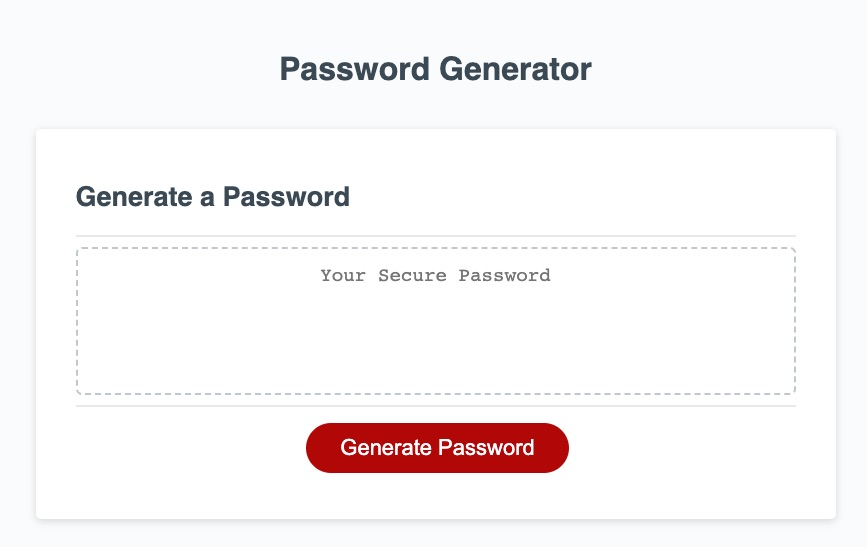

# Password Generator

## Description

This application allows a user to generate a secure password after answering a series of prompts about password length and character types to include. The password is a series of randomly selected characters, enhancing the security of the password.

## Installation

N/A

## Usage

View the [deployed application](https://sendusyourbones.github.io/password-generator/).

- Begin the password generation process by clicking "Generate Password"
- When prompted, enter the desired number of characters for your password (must be an integer between 8 - 128)
- When prompted, enter "yes" or "no" to whether to include each of the four character types
- After answering the final prompt, your password should appear on screen

## License

MIT License